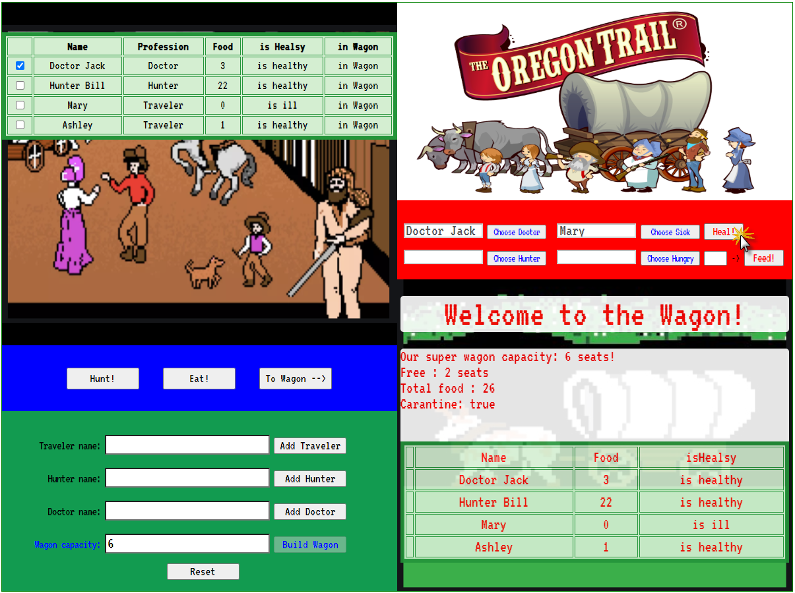

link: https://ev-ran.github.io/By-Oregon-Trail.-Extended/.
## By the path of Oregon Trail. Extended. [Use classes assessment]
*Classes
*Child Classes (Inheritance)
*Dynamic Tables
 

## Actions 

 * Add the characters:  Traveler , Hunter,  Doctor
 *  Add Wagon (set the Wagon capacity).
 * Create table with Travelers
 * Add choosen travelers to Wagon
 * Create synchronized table with Passengers (travelers in this Wagon)
 * Action Hunt - for choosen Traveler
* Action Hunt - for Hunter
 * Action Eat - for choosen Traveler
* Action Eat - for Hunter
* Action Heal [Doctor heal any Sick] 
* Action Feed [Hunter feed any Traveler]
* Set Carantine in Wagon [if any Sick is there]
 *  Display:
**  Wagon capacity
** Number of free seats in Wagon
** Total Food in Wagon
** Carantine - in Wagon
